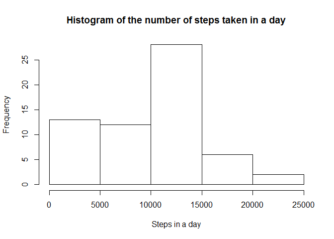
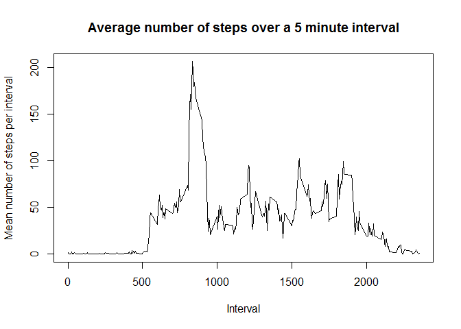
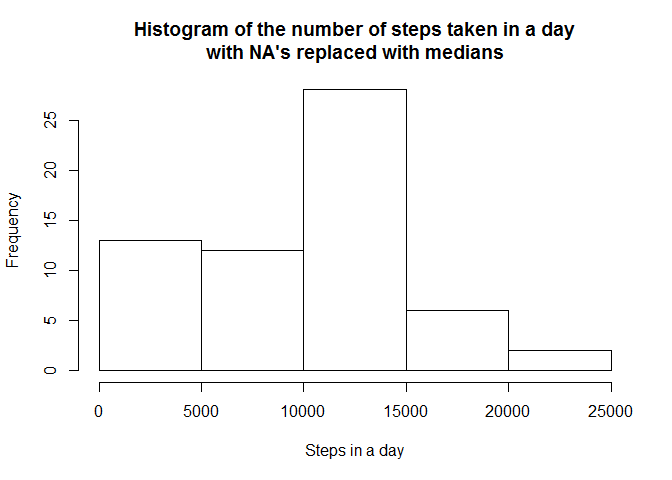
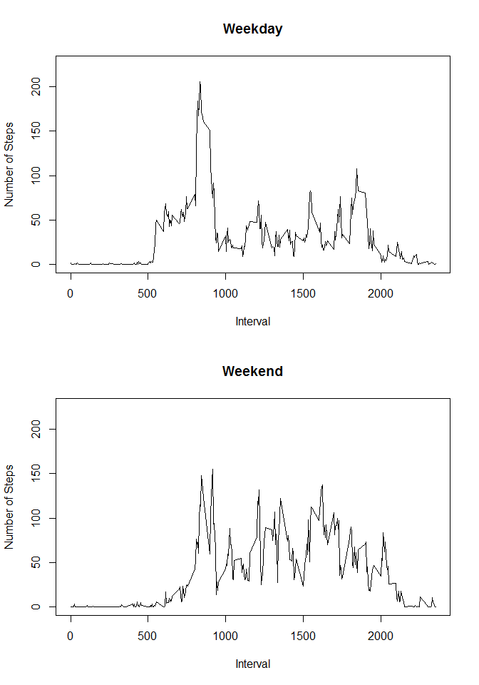

Loading and preprocessing the data
----------------------------------

    a <- read.csv("activity.csv")

What is mean total number of steps taken per day?
-------------------------------------------------

Generate a vector of the number of steps taken in each day in the data
set

    steps_per_day <- tapply(a$steps, a$date, sum, na.rm = TRUE)

Here is a histogram of the number of steps taken on a given day

    hist(
        steps_per_day,
        main="Histogram of the number of steps taken in a day", 
        xlab="Steps in a day"
    )

The mean number of steps per day is given by:

    mean(steps_per_day)

    ## [1] 9354.23

The median number of steps is given by:

    median(steps_per_day)

    ## [1] 10395

What is the average daily activity pattern?
-------------------------------------------

Generate a vector of the average number of steps split by interval

    mean_steps_per_interval <- tapply(a$steps, a$interval, mean, na.rm = TRUE)
    steps_intervals <- strtoi(attr(mean_steps_per_interval, "dimnames")[[1]])

Plot a time series

    plot(
        steps_intervals, 
        mean_steps_per_interval, 
        type="l", 
        main="Average number of steps over a 5 minute interval", 
        xlab="Interval", 
        ylab="Mean number of steps per interval"
    )

The interval that contains the hightest number of steps on average can
be determined by:

    steps_intervals[which.max(mean_steps_per_interval)]

    ## [1] 835

Inputing missing values
-----------------------

The total number of missing values in the data set is:

    sum(is.na(a$steps))

    ## [1] 2304

To deal with the missing values, replace the median for that interval.
There is definitely a faster way to do this than with a for loop but
this one works fine for now

    median_steps_per_interval <- tapply(a$steps, a$interval, median, na.rm = TRUE)
    a_na_replace <- a
    for(i in 1:nrow(a_na_replace)) {
        if(is.na(a_na_replace[i,"steps"])) {
            a_na_replace[i,"steps"] <- median_steps_per_interval[
                which(steps_intervals==a_na_replace[i,"interval"])
            ]
        }
    }

Here is a histogram of the step data with the NAs replaced by the
medians of the corresponding interval.

    steps_per_day_na_replace <- tapply(
        a_na_replace$steps,
        a_na_replace$date,
        sum
    )
    hist(
        steps_per_day_na_replace,
        main="Histogram of the number of steps taken in a day\nwith NA's replaced with medians", 
        xlab="Steps in a day"
    )

 It
appears that adding in missing data has taken days that recorded the
lowest number of steps and increased their values. This makes sense
considering that we are effectivly adding steps to intervals that did
not previously contribute to the number of steps in their respective
day.

The mean number of steps per day is found by:

    mean(steps_per_day_na_replace)

    ## [1] 9503.869

The median number of steps taken per day is found by:

    median(steps_per_day_na_replace)

    ## [1] 10395

As a reminder here is the mean and median values respectively, with the
missing values counted as 0:

    mean(steps_per_day)

    ## [1] 9354.23

    median(steps_per_day)

    ## [1] 10395

It appears the the missing data on the estimates of total numbers of
steps per day is minor or 1.015997% for the mean and 1% for the median.

Are there differences in activity patterns between weekdays and weekends?
-------------------------------------------------------------------------

Make a new column in the filled in dataset that identifies the date as a
weekday.

    a_na_replace$day_class  <- as.factor(
        ifelse(
            weekdays(as.Date(a_na_replace$date)) %in% c( "Saturday", "Sunday" ),
            "weekend",
            "weekday"
        )
    )

Now that we have a factor notating weekend vs weekday do the following
steps:

1.  Split the data set into weekend and weekday sets

2.  Get the interval means for each set

3.  Plot the two new weekday and weekend interval means for comparison

<!-- -->

    par(mfrow=c(2,1))
    a_na_replace_weekday <- subset(a_na_replace,a_na_replace$day_class == "weekday")
    mean_steps_per_interval_weekday <- tapply(
        a_na_replace_weekday$steps, 
        a_na_replace_weekday$interval,
        mean
    )
    plot(
        steps_intervals, 
        mean_steps_per_interval_weekday, 
        type="l", 
        main="Weekday", 
        xlab="Interval", 
        ylab="Number of Steps",
        ylim=c(0,225)
    )

    a_na_replace_weekend <- subset(a_na_replace,a_na_replace$day_class == "weekend")
    mean_steps_per_interval_weekend <- tapply(
        a_na_replace_weekend$steps, 
        a_na_replace_weekend$interval,
        mean
    )
    plot(
        steps_intervals, 
        mean_steps_per_interval_weekend, 
        type="l", 
        main="Weekend", 
        xlab="Interval", 
        ylab="Number of Steps",
        ylim=c(0,225)
    )

 It
appears that perhaps the subject likes to sleep in on the weekend as the
number of steps rises in the morning later on the weekend. It also
appears that the subject goes to bed later on the weekend as activity is
pushed later in the day on average. The largest source of walking
activity on weekdays does not appear to be present on the weekend, as
noted by the largest peak on the weekday plot that is missing on the
weekend plot. Finally, activity on the weeked appears to be more focused
on one time on weekdays while it is spread across the day more evenly on
the weekend.
